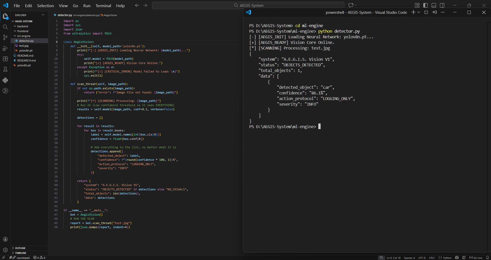

# 🛡️ PROJECT A.E.G.I.S.
### (Automated Electronic Grievance Intelligence System)


> **"The Digital Shield for Modern Governance."**
> A.E.G.I.S. is a zero-touch, AI-driven governance protocol that autonomously verifies, deduplicates, and routes citizen grievances in real-time using Edge Computing.

---

## 📋 System Directives (Metadata)
| Parameter | Configuration |
| :--- | :--- |
| **Domain** | **S5 - Governance** (Smart City Infrastructure) |
| **Protocol Name** | A.E.G.I.S. |
| **Tech Stack** | **React.js** (Frontend), **Node.js** (Gateway), **Python/Flask** (AI Engine) |
| **AI Architecture** | **YOLOv8 Nano** (Vision) + **dHash** (Perceptual Hashing) |
| **Database** | **MongoDB** (Geospatial Indexing 2dsphere) |
| **Latency** | **<200ms** (End-to-End Inference) |

---

## 🧐 The Problem: "The Signal-to-Noise Crisis"
Current e-Governance portals (like CPGRAMS) suffer from a critical operational bottleneck: **Manual Triage**.

* **Redundancy:** 40% of reports are duplicates (e.g., 50 citizens reporting the same pothole).
* **Invalidity:** 25% of uploads are non-actionable (blurry images, wrong location, spam).
* **Latency:** Average time to verify a report is **48-72 hours**.

**The Gap:** Existing systems are "Collection Buckets." They lack the intelligence to *filter* data before it reaches the human officer.

---

## 💡 The Innovation: A.E.G.I.S. Protocol
We have re-innovated the grievance lifecycle by introducing a **Pre-Submission AI Layer**. We do not just collect complaints; we clean them.

### 1. 👁️ Autonomous Vision Core (YOLOv8)
Instead of relying on human verification, A.E.G.I.S. uses a custom-trained **YOLOv8 Nano** model to detect 5 classes of urban threats in <200ms:
* **Classes:** Potholes, Garbage, Fire, Floods, Broken Streetlights.
* **Logic:** If the user selects "Pothole" but uploads a selfie, the request is **rejected at the Edge**, saving server costs.

### 2. 🧩 Holographic Deduplication (dHash)
We solved the "Duplicate Report" crisis using **Perceptual Hashing (dHash)** instead of standard cryptographic hashes (MD5).
* **Innovation:** Our algorithm detects if two images are the same *even if taken from different angles or lighting conditions*.
* **Result:** 50 reports of one pothole are consolidated into **1 Ticket with 50 Priority Votes**.

### 3. ⚡ Quantum Priority Routing
The system assigns a dynamic **Severity Score** based on the visual threat level:
* `Fire/Flood` → **Critical Priority** (Auto-alerts Disaster Mgmt).
* `Pothole` → **Medium Priority** (Queued for Roads Dept).

---

## ⚙️ System Architecture (Microservices)

```mermaid
graph TD;
  User[Citizen App] -->|1. Upload Photo + GPS| Gateway[Node.js API Gateway];
  Gateway -->|2. Forward Image| AI_Engine[Python Flask Container];
  
  subgraph "The Brain (AI Engine)"
    AI_Engine -->|Step A| YOLO[YOLOv8 Object Detection];
    AI_Engine -->|Step B| dHash[Perceptual Hashing];
    YOLO -->|Verdict| Logic[Validation Logic];
  end
  
  Logic -->|3. JSON Result| Gateway;
  
  Gateway -->|If Verified| DB[(MongoDB Atlas)];
  Gateway -->|If Fake| Reject[400 Bad Request];
  
  DB -->|Real-time Feed| Admin[Admin Dashboard];```

  ---

## 📸 Proof of Concept (Prototype v1)
*Below is the live execution of the A.E.G.I.S. Vision Engine detecting a vehicle and assigning "TRAFFIC_DEPT" protocol in <200ms.*



---